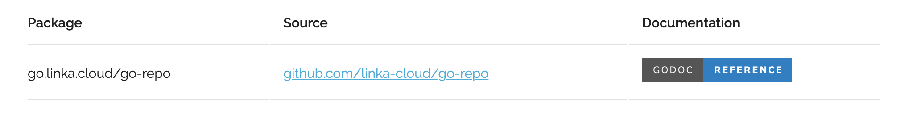

# go-repo

*go-repo* is a simple golang repository hosting web app, heavily inspired by [go.uber.org](https://go.uber.org).

It allows hosting go modules with custom import names.

Example :

```bash
$ go get go.linka.cloud/go-repo
```

instead of 

```bash
$ go get github.com/linka-cloud/go-repo
```

## Installation
```bash
$ docker pull linkacloud/go-repo
```

## Deployment

An example Kubernetes deployment is available in [the deploy directory](deploy/deploy.yml).

## Usage

```bash
$ go-repo

Usage:
  go-repo [config] [flags]

Examples:
go-repo config.yml

Flags:
  -a, --address string      The server address (default ":8888")
  -h, --help                help for go-repo
      --logs-level string    (default "info")

```

An example config file:
```yaml
modules:
- import: go.linka.cloud/go-repo
  repository: github.com/linka-cloud/go-repo
  readme: github.com/linka-cloud/go-repo/raw/master/README.md
```
The config file is reloaded on changes


Run the app:
```bash
$ go-repo config.yml
```

## Screenshots

The origin display the available packages index 


The details page display the README.md from configuration

